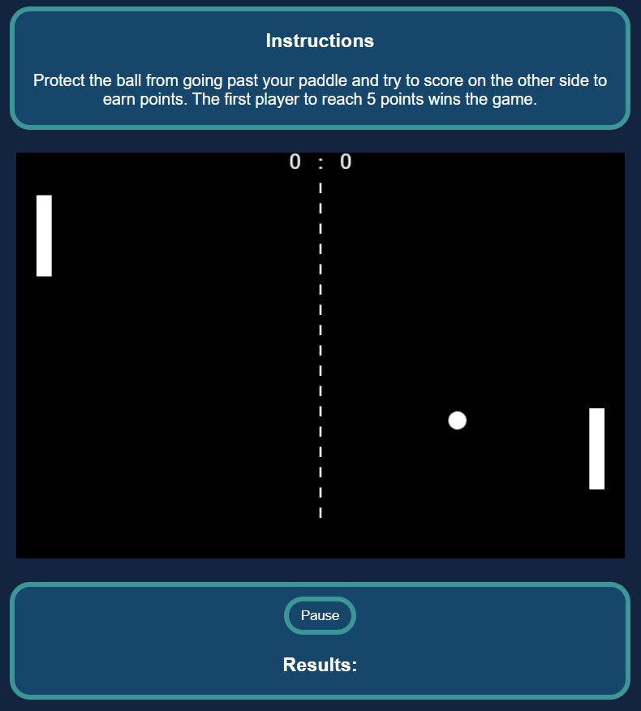

# Ping-pong Game

Ping-pong is a game where two players go against each other trying to keep the ball from going past their paddles. players score points by hitting the ball past their opponents paddle. once a player reaches score of 5 they win and the game displayes the winner.

# Getting started

[Ping Pong game link](https://alizulfiqarbuksh.github.io/ping-pong-game-project/)

Instructions

* press Enter key to start the game.
* Use W & S keys for player 1 paddle.
* Use Up & Down arrow keys for player 2.
* Once the game ends press reset button to play again.

# Attributions

# Technologies used

the technologies used to complete this project were: 
* HTML
* CSS
* Javascript

# Next steps

Many things can be added in the game to make it even more fun and enjoyable for the future such as:

power ups that can benefit a player when collected.
adding a rush mode with a timer so which ever player scores the most in that time wins.
